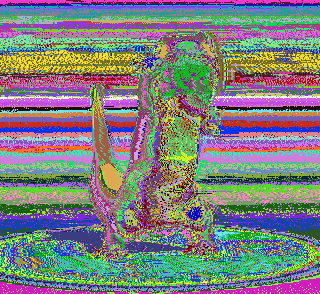
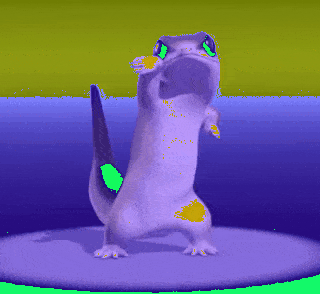
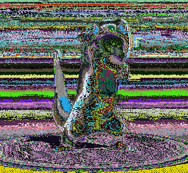
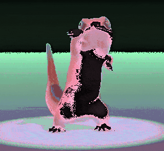
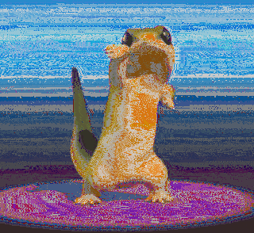
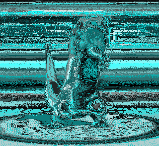

# gifthing

A small tool that messes with GIF files.

## Usage

Currently, you must clone the repository. You will need git and python >=3.6
installed.

```shell
git clone https://github.com/a-bison/gifthing
```

Then, install the package.

```shell
cd gifthing

# Windows
py -3 -m pip install .

# Linux
python3 -m pip install .
```

The `gifthing` application should now be usable from the command line.
Verify this with the following:

```shell
gifthing --version
```

You should see a version number printed.

## Known Issues

- This program will not work on GIFs with local color tables. To force
  a GIF to use only 256 colors, you can use [gifsicle](https://www.lcdf.org/gifsicle/):
  `gifsicle -k 256 input.gif -o output.gif`

## Examples

Here are some different commands and possible outputs.

### Original

The original image.

<p align="center">
    
</p>

### `gifthing randcolor --rgb`

Randomize all colors.

<p align="center">
    
</p>

### `gifthing randcolor --rgb --constant-offset`

Generate a random offset, and then apply it to all colors.

<p align="center">
    
</p>

### `gifthing randcolor --hsv`

Generate a random color table in [HSV color space](https://en.wikipedia.org/wiki/HSL_and_HSV),
and then convert to RGB.

<p align="center">
    
</p>

### `gifthing randcolor --hsv --constant-offset`

Convert the existing color table to HSV, generate a single random offset,
apply it to the color table, then convert back to RGB.

<p align="center">
    
</p>

### `gifthing randcolor --hsv --hold sv`

Convert the existing color table to HSV, randomize only the hue,
then convert back to RGB.

<p align="center">
    
</p>

### `gifthing randcolor --hsv --hold hv`

Convert the existing color table to HSV, randomize only the saturation,
then convert back to RGB.

<p align="center">
    
</p>

## Compound Examples

`gifthing` may be invoked multiple times with different modes on the same
image to produce more complex effects.

### Combining `setcolor` and `randcolor`

The following sets the same hue across all colors, then randomizes saturation
and brightness.

```shell
gifthing setcolor --hue 0.5 lizard.gif
gifthing randcolor --hsv --hold h lizard.gif
```

<p align="center">
    
</p>